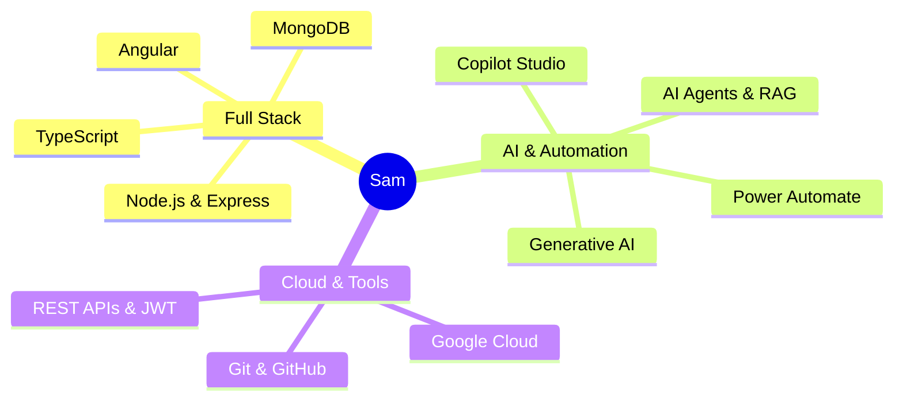

# 🚀 Saumyaranjan(Sam) N. ✦
### Full-Stack & AI Agent Developer

---

### 💡 Quick Bio
> **Full-Stack Developer (MEAN Stack)** & **AI Automation Enthusiast** turning complex business logic into clean, scalable software.

---

### 💻 Core Capabilities

---

### 🛠️ Tech Stack & Badges

---

### 🚀 Projects Overview

| Project | Highlights | Stack |
| :--- | :--- | :--- |
| 🌾 **MultilingualMandi** | AI-powered agricultural marketplace with multilingual voice/text interactions | Angular, Node.js, MongoDB, GenAI |
| 🛒 **Multi-Vendor E-Commerce** | Scalable marketplace with role-based auth and analytics | Angular, Express, MongoDB, JWT |
| 📱 **Loom** | Productivity task manager app | React Native, Expo, TypeScript |

---

### 📊 GitHub

- 💻 Check out my repositories: [github.com/Sdnsoumy](https://github.com/Sdnsoumy)
- 🚀 Building Full-Stack & AI Agent projects
- 🤖 Exploring Agentic AI & Generative AI
- ☁️ Working with Cloud & modern developer tools

---

### 📬 Connect
[Email](mailto:nayaksaumyaranjana@gmail.com) • [LinkedIn](https://www.linkedin.com/in/saumyarn21/) 
